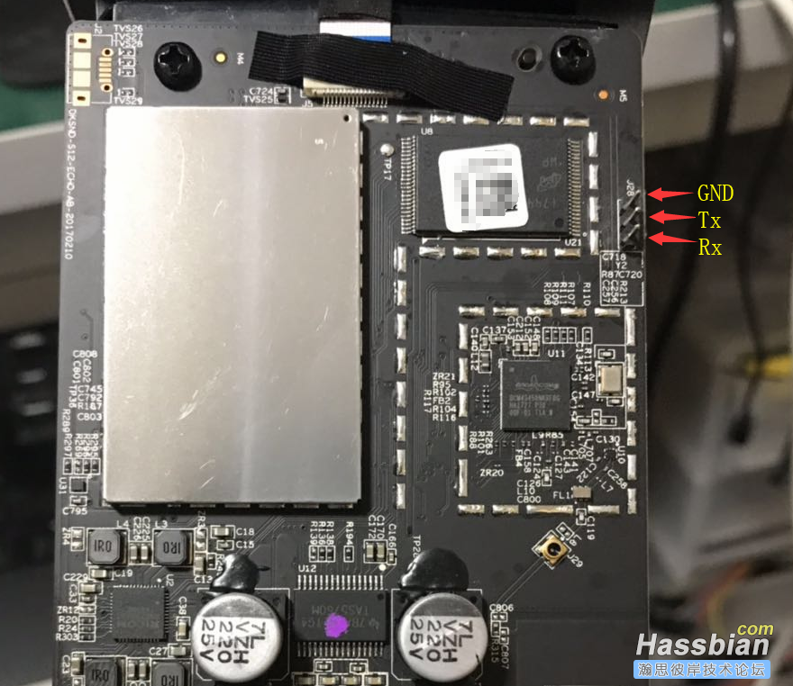

# 小米AI音箱-5402 The Mi AI SoundBox S12

### 设备信息


/data/dlna/device.xml

```xml
    <friendlyName>小米AI音箱-5402</friendlyName>
    <manufacturer>Mi, Inc.</manufacturer>
    <modelDescription>The Mi AI SoundBox</modelDescription>
    <modelName>S12</modelName>
    <modelNumber>S12</modelNumber>
    <qq:X_QPlay_SoftwareCapability
        xmlns:qq="http://www.tencent.com">QPlay:2
    </qq:X_QPlay_SoftwareCapability>
    <dlna:X_DLNADOC
        xmlns:dlna="urn:schemas-dlna-org:device-1-0">DMR-1.50
    </dlna:X_DLNADOC>
    <dlna:X_DLNACAP
        xmlns:dlna="urn:schemas-dlna-org:device-1-0">,
    </dlna:X_DLNACAP>
```


### 播放控制

[ubus](https://openwrt.org/docs/techref/ubus)

```bash
    ubus
    ubus list
    ubus list network.interface.*
    ubus -v list network.interface.lan

    ubus call network.interface.wan status
    ubus call network.device status '{ "name": "eth0" }'
    ubus listen &

    ubus call network.interface.wan down
    ubus call network.interface.wan up

    ubus listen &
    ubus send foo '{ "bar": "baz" }'

    ubus
    Usage: ubus [<options>] <command> [arguments...]
    Options:
     -s <socket>:           Set the unix domain socket to connect to
     -t <timeout>:          Set the timeout (in seconds) for a command to complete
     -S:                    Use simplified output (for scripts)
     -v:                    More verbose output
     -m <type>:             (for monitor): include a specific message type
                            (can be used more than once)
     -M <r|t>               (for monitor): only capture received or transmitted traffic

    Commands:
     - list [<path>]                        List objects
     - call <path> <method> [<message>]     Call an object method
     - listen [<path>...]                   Listen for events
     - send <type> [<message>]              Send an event
     - wait_for <object> [<object>...]      Wait for multiple objects to appear on ubus
     - monitor                              Monitor ubus traffic

    root@mico:~# ubus list
    ai_crontab
    alarm
    dlna
    led
    mediaplayer
    messagingagent
    mibrain
    mibt
    miio
    network
    network.device
    network.interface
    network.interface.lan
    network.interface.loopback
    network.wireless
    nightmode
    notify
    pnshelper
    qplayer
    service
    system
    upnp-disc
    voip
    volctl
    wifitool
    workday


```


#### uttpd + lua

+ [rpcd](https://archive.openwrt.org/chaos_calmer/15.05/arm64/generic/packages/packages/rpcd-mod-lxc_20141012_arm64.ipk)
+ [/etc/config/uhttpd](https://openwrt.org/docs/guide-user/services/webserver/uhttpd)
+ /etc/config/rpcd
+ /etc/config/system
+ /usr/share/rpcd/acl.d/superuser.json
+ /usr/share/rpcd/acl.d/*.json
+ `ubus_cors=1`


```bash
opkg install uhttpd-mod-lua luci-sgi-uhttpd
#edit /etc/config/uhttpd
/etc/init.d/uhttpd restart

data={
  "ubus_rpc_session": "xxxxx",
  "object": "requested-object",
  "function": "requested-method"
}
ubus call session access $data

```


```bash

url="http://localhost/ubus"
data='
{
  "jsonrpc": "2.0",
  "id": 1,
  "method": "call",
  "params": [
    "00000000000000000000000000000000",
    "session",
    "login",
    {
      "username": "root",
      "password": "secret"
    }
  ]
}
'
curl -d $data $url

```
```json
{
  "jsonrpc": "2.0",
  "id": 1,
  "result": [
    0,
    {
      "ubus_rpc_session": "c1ed6c7b025d0caca723a816fa61b668",
      "timeout": 300,
      "expires": 299,
      "acls": {
        "access-group": {
          "superuser": [
            "read",
            "write"
          ],
          "unauthenticated": [
            "read"
          ]
        },
        "ubus": {
          "*": [
            "*"
          ],
          "session": [
            "access",
            "login"
          ]
        },
        "uci": {
          "*": [
            "read",
            "write"
          ]
        }
      },
      "data": {
        "username": "root"
      }
    }
  ]
}


```

#### 示例

/sbin/ubusd

```lua

require("ubus")

function speak(s)
    --ubus -t 1000 call mibrain text_to_speech "{\"text\":\"$tts\",\"save\":0}"
 	local conn = ubus.connect()

	local s2 = conn:call("mibrain", "text_to_speech", {text=s,save=0})
	--local s1 = conn:call("mediaplayer", "player_set_volume", {volume=v })
	--local s2 = conn:call("mediaplayer", "player_set_loop", {type=0,media="common"})
	--local s3 = conn:call("mediaplayer", "player_play_url", { url=url,type=0 })

	conn:close()
end
```

```bash

root@mico:~# ubus list mediaplayer -v

'mediaplayer' @4920c7ce
        "player_wakeup":{"action":"String","source":"String"}
        "player_play_operation":{"media":"String","action":"String"}
        "player_play_url":{"url":"String","type":"Integer","domain":"String","media":"String","src":"String","id":"String","duration":"Integer"}
        "player_get_play_status":{}
        "player_play_status":{}
        "player_play_private_fm":{}
        "player_get_latest_playlist":{}
        "player_set_positon":{"position":"Integer","media":"String"}
        "player_set_loop":{"type":"Integer","media":"String"}
        "player_play_music":{"music":"String","startOffset":"Integer","loadMoreOffset":"Integer","media":"String","src":"String","id":"String","duration":"Integer"}
        "player_set_volume":{"volume":"Integer","media":"String"}
        "player_set_continuous_volume":{"volume":"Integer","media":"String"}
        "player_modify_volume":{"isVolumeUp":"Integer","value":"Integer"}
        "player_get_context":{}
        "player_play_index":{"index":"Integer","media":"String"}
        "player_play_alarm_reminder":{"type":"Integer","reminder":"String","volume":"Integer","timeReminder":"String","query":"String"}
        "player_play_album_playlist":{"type":"Integer","id":"String","startOffset":"Integer","media":"String"}
        "media_control":{"player":"String","action":"String","volume":"Integer"}
        "player_set_shutdown_timer":{"action":"String","hour":"Integer","minute":"Integer","second":"Integer","media":"String"}
        "test":{}
        "get_shutdown_timer":{}
        "get_media_volume":{}
        "player_reset":{}
        "player_retore_last_volume":{}
        "set_voip_status":{"voip_status":"String"}
        "set_player_quiet":{"quiet":"Boolean"}
        "set_playrate":{"rate":"String"}
        "notify_mdplay_status":{"status":"Integer","type":"Integer"}
        "player_aux_operation":{"aux_operation":"String"}

        cd /tmp
        mkidr ubus
        cd ubus
        for i in `ubus list` ; do ubus list $i -v >$i.txt  ;done


```


```bash


    ubus call mibt ble '{"action":"hidden"}'
    ubus call voip cmcc_unregister
    ubus -t 1 call ai_crontab remove_all
    ubus -t 1 call qplayer play {\"play\":\"$wakeup_wav\"}

    ubus call mibrain text_to_speech "{\"text\":\"呵呵\",\"save\":1}"
    ubus call mibrain text_to_speech "{\"text\":\"日志上传成功\",\"save\":0}"
    ubus call mibrain text_to_speech "{\"text\":\"日志上传失败\",\"save\":0}"

    #闪烁
    OP="8" # 2 6 9
    POS="2"#
    RGB="" #
    ubus -t 1 call led shut
    ubus -t 1 call led show "{\"L\":$OP,\"pos\":$POS}"
    ubus -t 1 call led show "{\"L\":$OP, \"rgb\":\"$RGB\"}"
    ubus -t 1 call led shut "{\"L\":$OP}"

    TIMEOUT=1
    MPATH="mediaplayer"
    METHOD="player_play_operation"
    VOIP_STATUS_IDLE="0x00000000"
    volume=70
    url="http://cdn.cnbj1.fds.api.mi-img.com/xiaomi0802/xiayu.mp3"

    ubus -t $TIMEOUT call $MPATH player_set_volume {\"volume\":"$volume"}
    ubus -t $TIMEOUT call $MPATH $METHOD  {\"action\":\"play\",\"media\":\"common\"}
    ubus -t $TIMEOUT call $MPATH $METHOD  {\"action\":\"play\",\"media\":\"common\"}
    ubus -t $TIMEOUT call $MPATH $METHOD {\"action\":\"pause\",\"media\":\"common\"}
    ubus -t $TIMEOUT call $MPATH $METHOD {\"action\":\"toggle\",\"media\":\"common\"}
    ubus -t $TIMEOUT call $MPATH $METHOD {\"action\":\"next\",\"media\":\"common\"}
    ubus -t $TIMEOUT call $MPATH $METHOD {\"action\":\"prev\",\"media\":\"common\"}
    ubus -t $TIMEOUT call $MPATH $METHOD {\"action\":\"channel\",\"media\":\"common\"}

    ubus -t 1 call mediaplayer player_play_url {\"url\":\""$url"\",\"type\":1}
    ubus -t1 -S call mediaplayer get_media_volume
    ubus -t 1 call mediaplayer player_wakeup {\"action\":\"start\"}
    ubus -t 1 call mediaplayer player_wakeup {\"action\":\"stop\"}

    ubus -t 10 call mediaplayer test
    ubus call mediaplayer player_get_play_status
    ubus -t 1 call mediaplayer player_get_context

    ubus -t 1 call mediaplayer player_play_url {\"url\":\"file:///usr/share/sound/command_timeout.mp3\",\"type\":1}
    ubus -t 1 call mediaplayer player_play_url {\"url\":\"file:///usr/share/sound/wifi_disconnect.mp3\",\"type\":1}
    ubus -t 1 call mediaplayer player_play_url {\"url\":\"file:///usr/share/sound/internet_disconnect.mp3\",\"type\":1}
    ubus -t 1 call mediaplayer player_play_url {\"url\":\"file:///usr/share/sound/mibrain_connect_timeout.mp3\",\"type\":1}
    ubus -t 1 call mediaplayer player_play_url {\"url\":\"file:///usr/share/sound/mibrain_service_timeout.mp3\",\"type\":1}
    ubus -t 1 call mediaplayer player_play_url {\"url\":\"file:///usr/share/sound/mibrain_network_unreachable.mp3\",\"type\":1}
    ubus -t 1 call mediaplayer player_play_url {\"url\":\"file:///usr/share/sound/mibrain_service_unreachable.mp3\",\"type\":1}
    ubus -t 1 call mediaplayer player_play_url {\"url\":\"file:///usr/share/sound/mibrain_auth_failed.mp3\",\"type\":1}
    ubus -t 1 call mediaplayer player_play_url {\"url\":\"file:///usr/share/sound/mibrain_start_failed.mp3\",\"type\":1}
    ubus -t 1 call mediaplayer player_play_url {\"url\":\"file:///usr/share/sound/upgrade_now.mp3\",\"type\":1}
    ubus -t 1 call mediaplayer player_play_url {\"url\":\"file:///usr/share/sound/upgrade_later.mp3\",\"type\":1}

    ubus call mediaplayer player_play_url {\"url\":\"file:///usr/share/sound/shutdown.mp3\",\"type\":1}
    ubus call mediaplayer player_play_url {\"url\":\"file:///usr/share/sound/ble.mp3\",\"type\":1}
    ubus call mediaplayer player_play_url {\"url\":\"file:///usr/share/sound/setupdone.mp3\",\"type\":1}
```

### ssh

 

+ 小爱 GTR
+ pc   GRT (黑白绿) 

小爱同学经常自动升级，
修改/etc/shadow 或/etc/passwd 没用了,重启以后会自动还原。。
ttl线手动连接需要输入root密码 (账号root)

#### 密码规则

```javascript

   u=require('utility')

   sn="00000/000000000" 
   //音箱底部贴纸上找，15位

   b="9C78089F-83C7-3CDC-BCC9-93B378868E7F"
   password=u.md5(sn+b).slice(0,14)
   console.log(password)

```


```bash
minicom

mico login: root
Password: 


BusyBox v1.23.2 (2019-11-11 03:44:52 UTC) built-in shell (ash)

  _______                     ________        __
 |       |.-----.-----.-----.|  |  |  |.----.|  |_
 |   -   ||  _  |  -__|     ||  |  |  ||   _||   _|
 |_______||   __|_____|__|__||________||__|  |____|
          |__| W I R E L E S S   F R E E D O M
 -----------------------------------------------------
 CHAOS CALMER (Chaos Calmer, unknown)
 -----------------------------------------------------
  * 1 1/2 oz Gin            Shake with a glassful
  * 1/4 oz Triple Sec       of broken ice and pour
  * 3/4 oz Lime Juice       unstrained into a goblet.
  * 1 1/2 oz Orange Juice
  * 1 tsp. Grenadine Syrup
 -----------------------------------------------------
root@mico:~# 

```
小爱同学升级以后有毒，

每次拆机连线太麻烦了。。。

被升级一次拆机配置一堆，还是做个服务吧。。


```bash
crontab -l
# explain crontab in https://crontab.guru/
#
# At every 5th minute.
*/5 * * * * /usr/sbin/easy_logcut size
# At every minute.
* * * * * /usr/sbin/network_probe.sh
# At 04:32.
32 4 * * * /usr/sbin/pns refresh
# At every 10th minute.
*/10 * * * * /usr/bin/check_mediaplayer_status
# At 03:00.
0 3 * * * /bin/ota slient  # check ota
root@mico:~# 


```


### 安装openwrt插件

小爱同学本质为openwrt套壳, 可用opkg安装openwrt的各种插件

#### 插件版本

+ cpu arm64 (aarch64)
+ openwrt 15.05.1

```bash

cat /proc/version 
Linux version 3.14.29 (jenkins@3f0613e75445) (gcc version 4.8.3 (OpenWrt/Linaro GCC 4.8-2014.04 unknown) ) #1 SMP PREEMPT Mon Nov 11 03:59:20 UTC 2019


root@mico:~# cat /proc/cpuinfo 
Processor       : AArch64 Processor rev 4 (aarch64)
processor       : 0
processor       : 1
processor       : 2
processor       : 3
Features        : fp asimd evtstrm aes pmull sha1 sha2 crc32 
CPU implementer : 0x41
CPU architecture: AArch64
CPU variant     : 0x0
CPU part        : 0xd03
CPU revision    : 4

Hardware        : Amlogic
Serial          : 210af2004d6194b776700628dc7baded
root@mico:~# 


```
查看openwrt版本

```bash
cat /etc/openwrt_version
15.05.1

cat /etc/openwrt_release

DISTRIB_ID='OpenWrt'
DISTRIB_RELEASE='Chaos Calmer'
DISTRIB_REVISION='unknown'
DISTRIB_CODENAME='chaos_calmer'   #https://archive.openwrt.org/chaos_calmer/
DISTRIB_TARGET='meson/gxl'        ###
DISTRIB_DESCRIPTION='OpenWrt Chaos Calmer 15.05.1'
DISTRIB_TAINTS='no-all glibc busybox'

```

#### 插件地址

[15.05 插件](https://archive.openwrt.org/chaos_calmer/15.05/arm64/generic/packages/)

```json
{
	"base": "https://archive.openwrt.org/chaos_calmer/15.05/arm64/generic/packages/base/",
	"luci": "https://archive.openwrt.org/chaos_calmer/15.05/arm64/generic/packages/luci/",
	"management": "https://archive.openwrt.org/chaos_calmer/15.05/arm64/generic/packages/management/",
	"packages": "https://archive.openwrt.org/chaos_calmer/15.05/arm64/generic/packages/packages/",
	"routing": "https://archive.openwrt.org/chaos_calmer/15.05/arm64/generic/packages/routing/",
	"telephony": "https://archive.openwrt.org/chaos_calmer/15.05/arm64/generic/packages/telephony/"
}

```

[15.05.1 插件 缺arm64](https://archive.openwrt.org/chaos_calmer/15.05.1/)

修改/etc/opkg/distfeeds.conf

```
src/gz chaos_calmer_base https://archive.openwrt.org/chaos_calmer/15.05/arm64/generic/packages/base
src/gz chaos_calmer_luci https://archive.openwrt.org/chaos_calmer/15.05/arm64/generic/packages/luci
src/gz chaos_calmer_management https://archive.openwrt.org/chaos_calmer/15.05/arm64/generic/packages/management
src/gz chaos_calmer_packages https://archive.openwrt.org/chaos_calmer/15.05/arm64/generic/packages/packages
src/gz chaos_calmer_routing https://archive.openwrt.org/chaos_calmer/15.05/arm64/generic/packages/routing
src/gz chaos_calmer_telephony https://archive.openwrt.org/chaos_calmer/15.05/arm64/generic/packages/telephony
# src/gz chaos_calmer_oldpackages http://downloads.openwrt.org/chaos_calmer/15.05.1/meson/gxl/packages/oldpackages

```

```bash
opkg update
opkg list

opkg find python
opkg find zsh

opkg install zsh
opkg install python


```

### [手动安装插件](https://archive.openwrt.org/chaos_calmer/15.05/arm64/generic/packages/packages/)

以openssh为例

```bash

wget https://archive.openwrt.org/chaos_calmer/15.05/arm64/generic/packages/packages/openssh-keygen_7.1p2-1_arm64.ipk
tar xzvf openssh-keygen_7.1p2-1_arm64.ipk 
tar xzvf data.tar.gz -C /

wget https://archive.openwrt.org/chaos_calmer/15.05/arm64/generic/packages/packages/openssh-server_7.1p2-1_arm64.ipk
#opkg install openssh-server_7.1p2-1_arm64.ipk
tar xzvf openssh-server_7.1p2-1_arm64.ipk 
./debian-binary
./data.tar.gz
./control.tar.gz

tar xzvf data.tar.gz -C /

```

#### 内置插件

root@mico:/tmp/z# opkg list-installed
+   6in4 - 21-2
+   6to4 - 12-2
+   agora-media - 0.0.1
+   alarm - 0.0.1
+   alsa-lib - 1.0.28-1
+   alsa-plugins - 1.1.1-2
+   alsa-utils - 1.0.28-2
+   ar - 2.24-3
+   base-files - 157.2-unknown
+   binutils - 2.24-3
+   busybox - 1.23.2-1
+   ca-bundle - 20180409-2
+   ca-certificates - 20180409-2
+   curl - 7.60.0-3
+   dlna - 1
+   dnsmasq - 2.78-5
+   drill - 1.6.17-2
+   dropbear - 2015.67-1
+   e2fsprogs - 1.42.12-1
+   fstools - 2016-01-10-96415afecef35766332067f4205ef3b2c7561d21
+   glib2 - 2.43.4-1
+   glog - 0.3.5-1
+   hostapd - 2017-08-24-3
+   hostapd-common - 2017-08-24-3
+   htop - 1.0.3-1
+   htpdate - 1.0.4-1
+   i2c-tools - 2013-12-15-1
+   iperf - 2.0.5-1
+   iputils-ping - 20101006-1
+   iputils-ping6 - 20101006-1
+   iputils-tracepath - 20101006-1
+   iputils-tracepath6 - 20101006-1
+   iputils-traceroute6 - 20101006-1
+   iw - 4.3-1
+   jshn - 2017-09-29-632688e8-10429bccd0dc5d204635e110a7a8fae7b80d16cb
+   jsonfilter - 2014-06-19-cdc760c58077f44fc40adbbe41e1556a67c1b9a9
+   kernel - 3.14.29-1-55e86761b221b7a3819a24d8a972fa3f
+   kmod-bcm43458 - 3.14.29-1
+   kmod-cfg80211 - 3.14.29+2016-01-10-1
+   kmod-input-core - 3.14.29-1
+   kmod-iptunnel - 3.14.29-1
+   kmod-iptunnel4 - 3.14.29-1
+   kmod-ipv6 - 3.14.29-1
+   kmod-leds-is31fl3236a - 3.14.29-1
+   kmod-lib-crc-ccitt - 3.14.29-1
+   kmod-lib80211 - 3.14.29+2016-01-10-1
+   kmod-sit - 3.14.29-1
+   kmod-sound-core - 3.14.29-1
+   kmod-xiaomi-cyttsp - 3.14.29-1
+   leveldb - 1.20-1
+   libattr - 20150220-1
+   libbfd - 2.24-3
+   libblobmsg-json - 2017-09-29-632688e8-10429bccd0dc5d204635e110a7a8fae7b80d16cb
+   libbz2 - 1.0.6-2
+   libc - 2.19-1
+   libconfig - 1.4.9-2
+   libcurl - 7.60.0-3
+   libdbi - 0.9.0-4
+   libdirac - 2.4-0
+   libdw - 0.161-1
+   libelf1 - 0.161-1
+   libevent2 - 2.0.22-1
+   libeventlog - 0.2.9-2
+   libext2fs - 1.42.12-1
+   libffi - 3.0.13-1
+   libflac - 1.3.1-1
+   libgcc - 4.8-linaro-1
+   libgmp - 6.0.0-1
+   libgnutls - 3.4.15-1
+   libgssdp - 1.0.2-1
+   libgupnp - 1.0.2-1
+   libi2c - 2013-12-15-1
+   libiconv-full - 1.11.1-1
+   libintl-full - 0.19.6-2
+   libip4tc - 1.4.21-1
+   libip6tc - 1.4.21-1
+   libjson-c - 0.12-1
+   libjson-script - 2017-09-29-632688e8-10429bccd0dc5d204635e110a7a8fae7b80d16cb
+   libldns - 1.6.17-2
+   liblua - 5.1.5-1
+   liblzo - 2.08-1
+   libncurses - 5.9-2
+   libnettle - 3.1.1-1
+   libnghttp2 - 1.32.0-1
+   libnl-tiny - 0.1-4
+   libogg - 1.3.2-2
+   libopcodes - 2.24-3
+   libopenssl - 1.0.2h-1
+   libopus - 1.1-1
+   libopusfile - 0.11-1
+   libpcre - 8.41-2
+   libpolarssl - 1.3.14-1
+   libprotobuf-c - v1.0.1
+   libpthread - 2.19-1
+   libreadline - 6.3-1
+   librt - 2.19-1
+   libsndfile - 1.0.28-1
+   libsoup - 2.53.2-1
+   libspeexdsp - 1.2rc1-1
+   libsqlite3 - 3081101-1
+   libstdcpp - 4.8-linaro-1
+   libthrift - 0.11.0-1
+   libubox - 2017-09-29-632688e8-10429bccd0dc5d204635e110a7a8fae7b80d16cb
+   libubus - 2017-02-18-34c6e818-34c6e818
+   libuci - 2017-09-29-5ad59ad4.1-1
+   libuci-lua - 2017-09-29-5ad59ad4.1-1
+   libuuid - 2.25.2-4
+   libwrap - 7.6-1
+   libxml2 - 2.9.2-3
+   libxtables - 1.4.21-1
+   lua - 5.1.5-1
+   mediaplayer - 0.0.1
+   messagingagent - 1-1.1
+   mibrain - 1
+   mibrain-common-sdk - 0.0.1
+   mibrain-service - 0.0.1
+   mibt - 0.0.1
+   mico-ai-crontab - 0.0.1
+   mico-miio - 0.0.1
+   mico-misc - 0.1.1-1
+   mico-upgrade - 1.0.0-1
+   mico-vendor - 0.0.1
+   mimc_sdk - 0.0.1
+   mipns-general - 1
+   mipns-helper - 0.0.1
+   mipns-sai - 1
+   mipns-xiaomi - 1
+   mitv-agent - 0.0.1
+   mtd - 21
+   nano-httpd - 0.0.1
+   netifd - 2015-12-16-245527193e90906451be35c2b8e972b8712ea6ab
+   notify - 0.0.1
+   objdump - 2.24-3
+   opkg - 9c97d5ecd795709c8584e972bfdf3aee3a5b846d-9
+   perf - 3.14.29-2
+   procd - 2017-09-28-ee582d16-1
+   quickplayer - 0.0.1
+   rapidjson - 1.1.0-1
+   snappy - 1.1.7-1
+   sqlite3-cli - 3081101-1
+   strace - 4.8-1
+   stund - 0.97-1
+   syslog-ng - 3.0.5-5
+   terminfo - 5.9-2
+   traceroute - 2.1.0-1
+   ubi-utils - 1.5.1-2
+   ubox - 2017-09-01-d73e7d288-c086167a0154745c677f8730a336ea9cf7d71031
+   ubus - 2017-02-18-34c6e818-34c6e818
+   ubusd - 2017-02-18-34c6e818-34c6e818
+   uci - 2017-09-29-5ad59ad4.1-1
+   upnp-disc - 1
+   usign - 2015-05-08-cf8dcdb8a4e874c77f3e9a8e9b643e8c17b19131
+   vad-sdk - 1
+   voip - 0.0.1
+   volctl - 0.0.1
+   wget - 1.17.1-1
+   wpa-cli - 2017-08-24-3
+   wpa-supplicant - 2017-08-24-3
+   xiaoqiang-util - 1-1.1
+   zlib - 1.2.8-1
+   zoneinfo-core - 2015d-1

#### uci

```bash
uci show
dhcp.@dnsmasq[0]=dnsmasq
dhcp.@dnsmasq[0].domainneeded='1'
dhcp.@dnsmasq[0].boguspriv='1'
dhcp.@dnsmasq[0].filterwin2k='0'
dhcp.@dnsmasq[0].localise_queries='1'
dhcp.@dnsmasq[0].local='/lan/'
dhcp.@dnsmasq[0].domain='lan'
dhcp.@dnsmasq[0].expandhosts='1'
dhcp.@dnsmasq[0].nonegcache='0'
dhcp.@dnsmasq[0].authoritative='1'
dhcp.@dnsmasq[0].readethers='0'
dhcp.@dnsmasq[0].leasefile='/tmp/dhcp.leases'
dhcp.@dnsmasq[0].resolvfile='/tmp/resolv.conf.auto'
dhcp.@dnsmasq[0].localservice='1'
dhcp.lan=dhcp
dhcp.lan.interface='lan'
dhcp.lan.start='100'
dhcp.lan.limit='150'
dhcp.lan.leasetime='12h'
dhcp.lan.ignore='1'
dropbear.@dropbear[0]=dropbear
dropbear.@dropbear[0].PasswordAuth='0'
dropbear.@dropbear[0].RootPasswordAuth='0'
dropbear.@dropbear[0].Port='22'
network.loopback=interface
network.loopback.ifname='lo'
network.loopback.proto='static'
network.loopback.ipaddr='127.0.0.1'
network.loopback.netmask='255.0.0.0'
network.lan=interface
network.lan.ifname='wlan0'
network.lan.proto='static'
network.lan.ipaddr='10.0.0.1'
network.lan.netmask='255.0.0.0'
system.@system[0]=system
system.@system[0].hostname='mico'
system.@system[0].zonename='PRC'
system.ntp=timeserver
system.ntp.server='0.openwrt.pool.ntp.org' '1.openwrt.pool.ntp.org' '2.openwrt.pool.ntp.org' '3.openwrt.pool.ntp.org'
system.ntp.enabled='1'
system.ntp.enable_server='0'
system.pns=pnsservice
system.pns.tts_vendor='AiNiRobot:活泼可爱' 'XiaoMi:温柔知性'
system.pns.vendor='soundai'
system.pns.dummydev='on'
system.pns.distrib_wakeup='on
```

#### process


```bash

    1 root      2756 S    /sbin/procd
    2 root         0 SW   [kthreadd]
    3 root         0 SW   [ksoftirqd/0]
    5 root         0 SW<  [kworker/0:0H]
    6 root         0 SW   [kworker/u8:0]
    7 root         0 SW   [rcu_preempt]
    8 root         0 SW   [rcu_sched]
    9 root         0 SW   [rcu_bh]
   10 root         0 SW   [migration/0]
   11 root         0 SW   [watchdog/0]
   12 root         0 SW   [watchdog/1]
   13 root         0 SW   [migration/1]
   14 root         0 SW   [ksoftirqd/1]
   15 root         0 SW   [kworker/1:0]
   16 root         0 SW<  [kworker/1:0H]
   17 root         0 SW   [watchdog/2]
   18 root         0 SW   [migration/2]
   19 root         0 SW   [ksoftirqd/2]
   21 root         0 SW<  [kworker/2:0H]
   22 root         0 SW   [watchdog/3]
   23 root         0 SW   [migration/3]
   24 root         0 SW   [ksoftirqd/3]
   25 root         0 SW   [kworker/3:0]
   26 root         0 SW<  [kworker/3:0H]
   27 root         0 SW<  [khelper]
   28 root         0 SW   [kdevtmpfs]
   29 root         0 SW   [kworker/u8:1]
   33 root         0 SW<  [suspend]
  266 root         0 SW<  [writeback]
  269 root         0 SW<  [bioset]
  270 root         0 SW<  [crypto]
  272 root         0 SW<  [kblockd]
  285 root         0 SW<  [devfreq_wq]
  294 root         0 SW   [kworker/0:1]
  296 root         0 SW<  [cfg80211]
  418 root         0 SW   [khungtaskd]
  424 root         0 SW   [kswapd0]
  468 root         0 SW   [fsnotify_mark]
  522 root         0 SW   [cfinteractive]
  523 root         0 SW   [NULL_task_for_h]
  524 root         0 SW   [cpu_hotplug_gdb]
  525 root         0 RW   [cpu_idle_gdbs]
  531 root         0 SW<  [binder]
  550 root         0 SW   [irq/248-sd_emmc]
  631 root         0 RW   [kworker/1:1]
  646 root         0 SW<  [ipv6_addrconf]
  653 root         0 SW<  [krfcommd]
  659 root         0 SW<  [deferwq]
  675 root         0 SW   [kworker/3:1]
  680 root         0 SW   [ubi_bgt0d]
  683 root         0 SW   [ubifs_bgt0_0]
  707 root         0 SW   [kworker/2:1]
  868 root      2152 S    /sbin/ubusd
  869 root      2016 S    /sbin/askfirst /bin/login
  870 root      2016 S    /sbin/askfirst /bin/ash --login
 1230 root         0 SW   [ubi_bgt1d]
 1233 root         0 SW   [ubifs_bgt1_0]
 1323 root      2548 S    /sbin/netifd
 1340 root      146m S <  /bin/ledserver
 1436 root      3136 S    /usr/sbin/crond -f -c /etc/crontabs -L /dev/null
 1460 root      4520 S    /usr/sbin/sshd -D
 1465 root      6740 S    {syslog-ng} supervising syslog-ng
 1466 root      6992 S    /usr/sbin/syslog-ng
 1490 root      200m S    /usr/bin/bsa_server -d /dev/ttyS1 -r 13 -lpm -p /etc/bt/bcmdhd_37M.hcd -u /var/run/ --all=0
 1491 root     79692 S    /usr/bin/mibt_ble
 1525 root     82072 S    /usr/bin/work_day_sync_service
 1534 root      8652 S    /usr/bin/xiaomi_dns_server
 1576 root         0 SW   [wl_event_handle]
 1578 root         0 SW   [dhd_watchdog_th]
 1579 root         0 RW   [dhd_dpc]
 1580 root         0 SW   [dhd_rxf]
 1596 root         0 SW   [kworker/0:2]
 1626 root      3600 S    /usr/sbin/wpa_supplicant -Dnl80211 -iwlan0 -c/data/wifi/wpa_supplicant.conf -s
 1629 root      3032 S    {wifi_check_ccmp} /bin/sh /bin/wifi_check_ccmp.sh
 1664 root      3032 S    udhcpc -f -S -s /bin/simple_dhcp.sh -R -t 0 -i wlan0 -x hostname MiAiSoundbox
 1870 root      360m S    /usr/bin/mediaplayer
 1895 root     1056m S    /usr/bin/messagingagent --handler_threads 8
 1910 root      2484 S    /usr/bin/notifyd
 1940 root      2044 S    /bin/wifitool
 1972 root      7392 S    /usr/bin/statpoints_daemon
 3400 root     2237m S <  /usr/bin/mipns-sai -c /usr/share/sai -l
 3484 root      2052 S    /bin/touchpad
 3576 nobody    2032 S    /usr/sbin/dnsmasq -C /var/etc/dnsmasq.conf -k -x /var/run/dnsmasq/dnsmasq.pid
 3619 root     83680 S    /usr/bin/dlna
 3648 root     93476 S    /usr/bin/upnp-disc
 3705 root      2336 S    /usr/bin/alarmd
 3752 root      7444 S    /usr/bin/mibrain_service
 3765 root     76232 S    /usr/bin/mico_ai_crontab
 3781 root      2124 S    /usr/bin/nano_httpd
 3794 root      5052 S    /usr/bin/pns_ubus_helper
 3805 root     10832 S    /usr/bin/quickplayer
 3817 root      295m S    /usr/bin/voip_service
 3828 root     10272 S    /usr/bin/volctl
 3832 root      2164 S    /usr/sbin/wpa_cli -a/bin/wpa_action.sh
 3898 root     76220 S    /usr/bin/miio_client -L /dev/null
 3899 root      3032 S    {miio_client_hel} /bin/sh /usr/bin/miio_client_helper
 4104 root      1492 S    /usr/bin/miio_recv_line
 4298 root      2416 S    /usr/bin/miio_service
 4541 root         0 SW   [kworker/2:2]
 4548 root      7080 R    sshd: root@ttyp0
 4550 root      3200 S    -ash
 7293 root      3124 S    bash
 8941 root         0 SW   [kworker/u8:2]
 9783 root      2900 S    sleep 5
 9787 root      3200 R    ps


```
